# OpenSaaS/Wasp Architecture & Workflow Diagrams

## Table of Contents
1. [Framework Architecture Overview](#1-framework-architecture-overview)
2. [Request/Response Flow](#2-requestresponse-flow)
3. [Database Operations Flow](#3-database-operations-flow)
4. [Authentication Workflow](#4-authentication-workflow)
5. [Payment & Subscription Flow](#5-payment--subscription-flow)
6. [Development Workflow](#6-development-workflow)
7. [Testing Strategy Flow](#7-testing-strategy-flow)
8. [Deployment Pipeline](#8-deployment-pipeline)

---

## 1. Framework Architecture Overview

---

## 2. Request/Response Flow

---

## 3. Database Operations Flow

### Database Operation Example Flow

---

## 4. Authentication Workflow

### Detailed Auth Flow

---

## 5. Payment & Subscription Flow

### Detailed Payment Flow

---

## 6. Development Workflow

---

## 7. Testing Strategy Flow

### Test Execution Flow

```mermaid
sequenceDiagram
    participant Dev as Developer
    participant Git
    participant CI as CI/CD
    participant Vitest
    participant Playwright
    participant Coverage
    participant Deploy
    
    Dev->>Git: git push
    Git->>CI: Trigger pipeline
    
    CI->>CI: Install dependencies
    CI->>CI: Build application
    
    par Run Tests in Parallel
        CI->>Vitest: Run unit tests
        Vitest-->>CI: ✓ 150 passed
    and
        CI->>Playwright: Run E2E tests
        Playwright-->>CI: ✓ 25 passed
    end
    
    CI->>Coverage: Generate report
    Coverage-->>CI: 85% coverage
    
    alt All Tests Pass
        CI->>Deploy: Deploy to staging
        Deploy-->>CI: Deployed successfully
        CI-->>Dev: ✅ Pipeline passed
    else Tests Failed
        CI-->>Dev: ❌ Pipeline failed
        Dev->>Dev: Fix issues
        Dev->>Git: git push (retry)
    end
```

---

## 8. Deployment Pipeline

### Deployment Process Detail

---

## Data Flow Summary

---

## Key Takeaways

### 🏗️ Architecture Patterns
- **Separation of Concerns**: Clear boundaries between client, server, and data layers
- **Type Safety**: End-to-end type safety from database to UI
- **Code Generation**: Wasp generates boilerplate, reducing manual work
- **Convention over Configuration**: Standardized patterns for common tasks

### 🔄 Data Flow Patterns
- **Unidirectional Data Flow**: Client → API → Operations → Database
- **Optimistic Updates**: Immediate UI updates with background sync
- **Caching Strategy**: Multiple cache layers for performance
- **Event-Driven**: Webhooks and background jobs for async operations

### 🚀 Development Patterns
- **Database-First**: Start with schema, generate types
- **Operation-Centric**: Queries for reading, Actions for writing
- **Component Isolation**: Reusable, testable components
- **Progressive Enhancement**: Start simple, add complexity as needed

### 🔒 Security Patterns
- **Authentication Layers**: Multiple auth methods with verification
- **Authorization**: Role-based access control at operation level
- **Input Validation**: Server-side validation for all operations
- **Secure by Default**: HTTPS, CORS, CSP headers configured

### 📊 Performance Patterns
- **Lazy Loading**: Load data as needed
- **Query Optimization**: Prisma query optimization
- **Background Processing**: Offload heavy work to job queues
- **CDN Integration**: Static assets served from edge

These diagrams provide a comprehensive view of how OpenSaaS/Wasp orchestrates the various components to create a full-stack application with minimal boilerplate while maintaining flexibility and scalability.